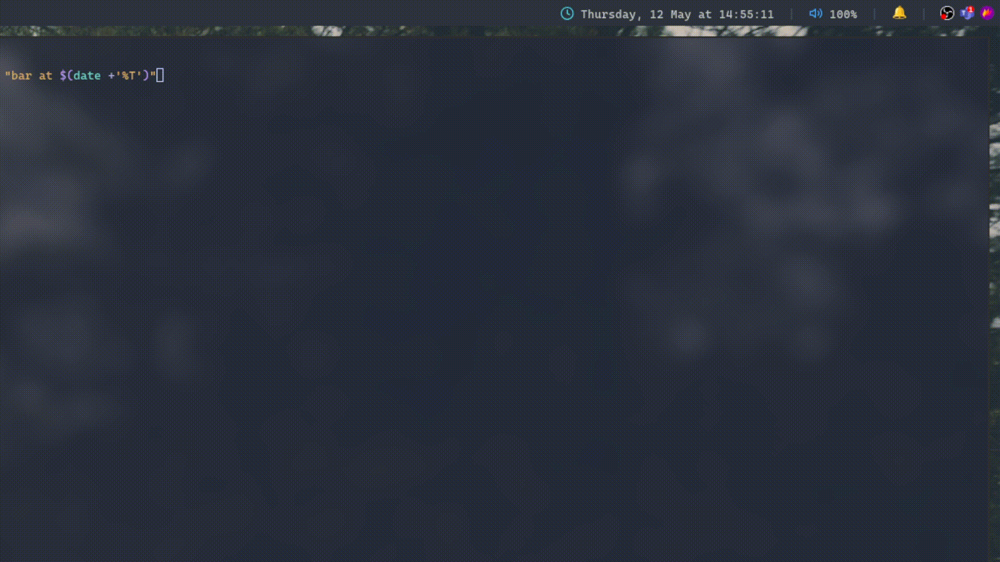

# Dunst polybar

Polybar module for dunst history

## Dependencies
- Dunst
- JQ

## Usage

The script expects parameters :
 - `display_history` used to display history. If used with a number display number amount of history. Default display all.
 - `close_history` used to close all notification.

Example module for polybar

```ini
[module/dunst]
type = custom/text

content = "🔔"

; "click-(left|middle|right)" will be executed using "/usr/bin/env sh -c $COMMAND"
click-left = ~/.config/polybar/forest/scripts/dunst.sh display-history 10
click-middle = ~/.config/polybar/forest/scripts/dunst.sh display-history
click-right = ~/.config/polybar/forest/scripts/dunst.sh close-history &
```

## Demo
